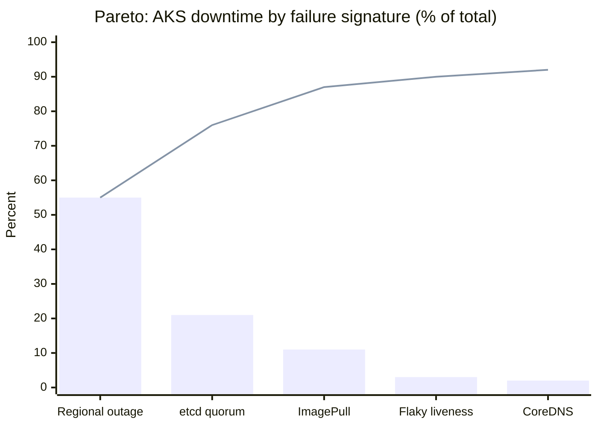
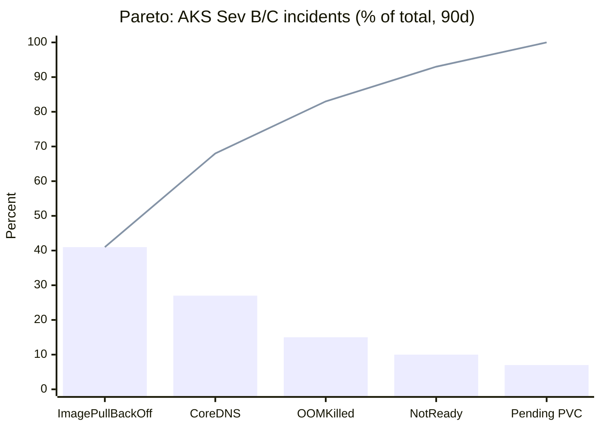
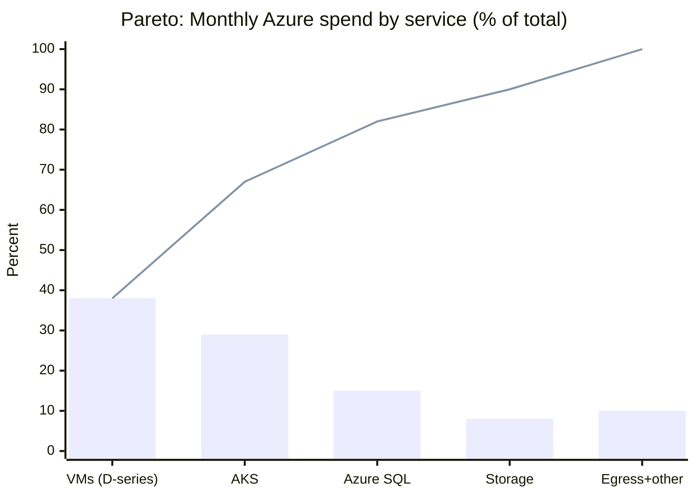
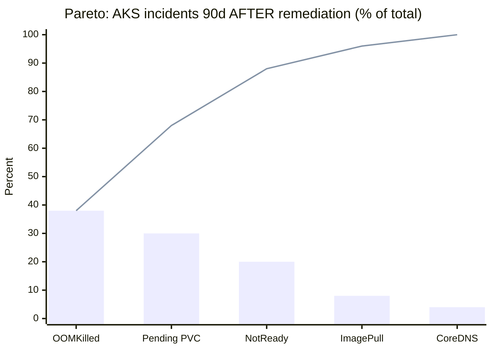
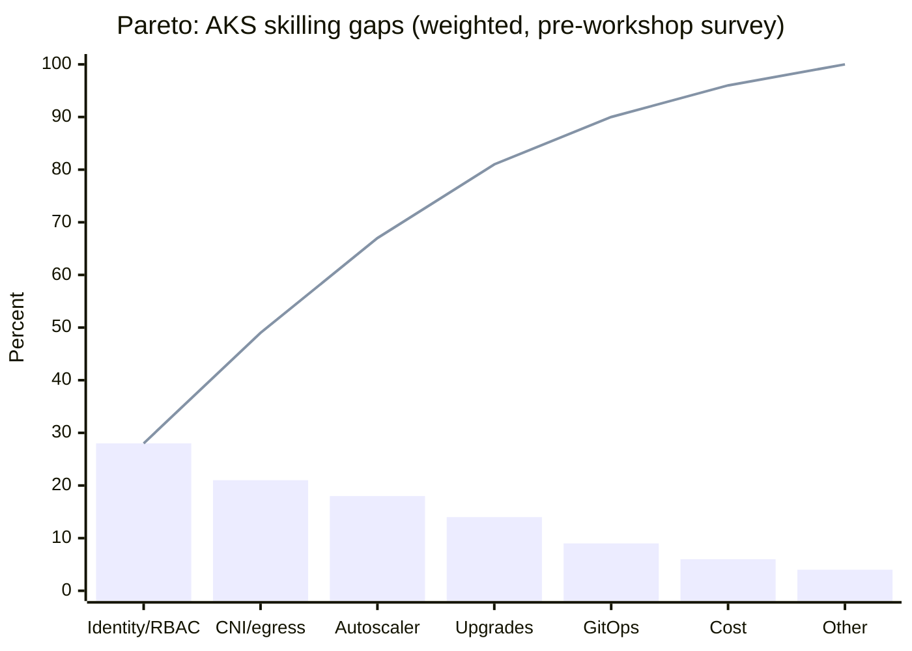
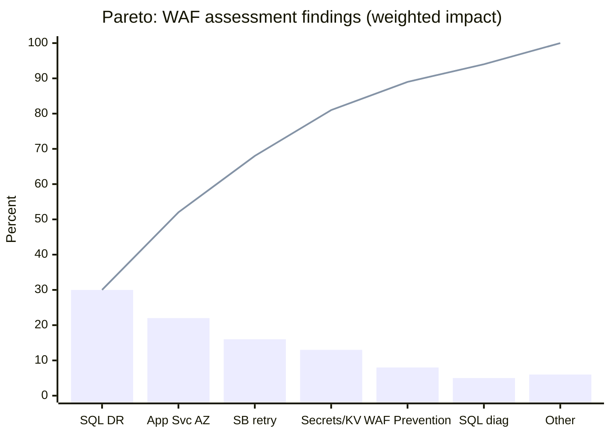
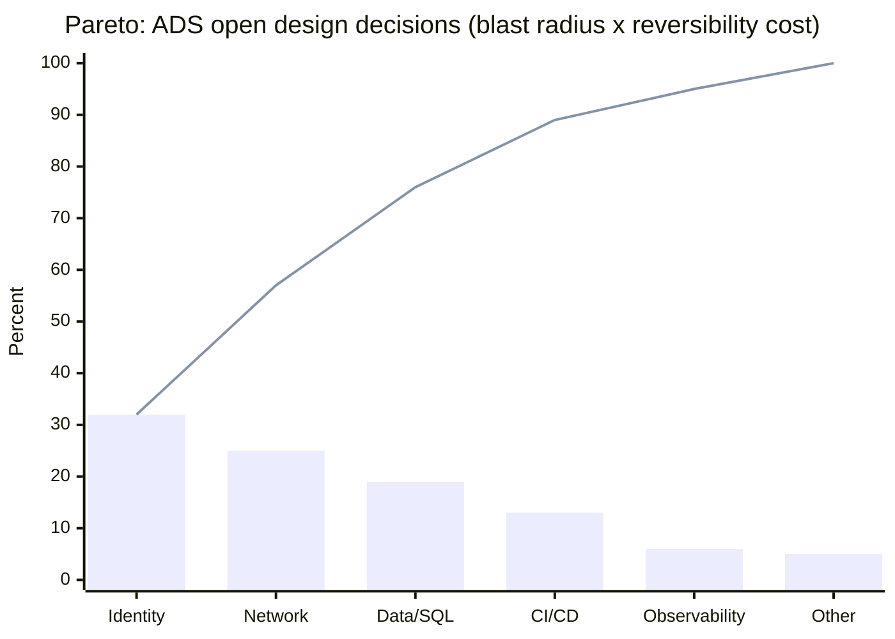
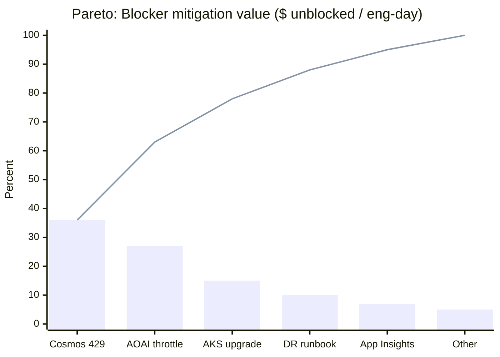

# Pareto Chart

## TL;DR

A Pareto chart ranks categories (incident signatures, error codes, resource types, $ spend) in descending order and overlays a cumulative percentage line so the "vital few" causes driving ~80% of impact are immediately visible. For CSAs it is a prioritization tool: weight by business impact (downtime minutes, $, RU/s, severity), not raw counts; use it for EBR/QBR prep, WAF reviews, cost optimization, escalation triage, and post-incident retrospectives; don't use it for time-series or continuous data. Build it, drive the engagement on the top bars, then re-measure to validate.

## Table of Contents

- [Why Pareto Charts](#why-pareto-charts)
- [What is a Pareto Chart](#what-is-a-pareto-chart)
- [How to use Pareto Charts](#how-to-use-pareto-charts)
- [When to use Pareto Charts](#when-to-use-pareto-charts)
- [Where to use Pareto Charts](#where-to-use-pareto-charts)
- [Who should use Pareto Charts](#who-should-use-pareto-charts)
- [Examples](#examples)

## Why Pareto Charts

A CSA's time is the constraint. Customers report dozens of symptoms, ICM queues fill with incidents, and every workload looks urgent. A Pareto chart forces a ranking by impact so engagement hours land on the small set of issues driving the majority of customer pain, Azure consumption risk, or reliability loss.

Concretely, it supports:

- Quarterly account planning — which workloads consume CSA hours vs. which generate the most ACR.
- Escalation triage — which Sev A/B incident signatures repeat across an account or portfolio.
- Reliability reviews (WAF / Azure Advisor) — which failure modes cause the majority of downtime minutes.
- Cost optimization — which resources or SKUs drive the majority of monthly spend or waste.
- Renewal and consumption risk — which blockers account for most stalled commitments.

**Real example:** A CSA managing a Tier-1 retail account pulled 90 days of ICM tickets for the customer's AKS estate. Two signatures — `ImagePullBackOff` from a private ACR and CoreDNS resolution failures during node upgrades — accounted for 71% of all Sev B incidents. The CSA stopped reacting case-by-case and drove a single architecture review covering ACR private endpoint + kubelet managed identity and CoreDNS autoscaler tuning. ICM volume for that customer dropped ~60% the following quarter.

## What is a Pareto Chart

A Pareto chart combines a descending bar chart of categorical impact with a cumulative percentage line. It operationalizes the Pareto principle (~80% of effects from ~20% of causes) for prioritization decisions.

Components:

- **X-axis** — categories: incident signatures, error codes, resource types, customer workloads, root-cause classifications, Azure regions, SKUs.
- **Left Y-axis** — measured impact: ticket count, downtime minutes, RU/s consumed, $ spend, dropped messages, failed deployments.
- **Right Y-axis** — cumulative percentage (0–100%).
- **Bars** — sorted descending by impact.
- **Cumulative line** — running total; the 80% reference line marks the "vital few".

The unit of measure matters more than the chart. Counting tickets weights a 5-minute glitch equal to a 6-hour outage. CSAs should usually weight by **business impact** (downtime minutes, $ at risk, customer-reported severity) rather than raw frequency.

**Real example:** A CSA built two Pareto views for the same AKS customer — by incident count vs. by downtime minutes:

| Failure signature | Count | Cum % |  | Failure signature | Downtime min | Cum % |
| ----------------- | ----- | ----- |--| ----------------- | ------------ | ----- |
| Flaky liveness    | 142   | 48%   |  | Regional outage   | 240          | 55%   |
| ImagePullBackOff  | 70    | 71%   |  | etcd quorum loss  | 90           | 76%   |
| CoreDNS timeout   | 40    | 85%   |  | ImagePullBackOff  | 50           | 87%   |
| Node NotReady     | 30    | 95%   |  | Flaky liveness    | 12           | 90%   |
| Regional outage   | 12    | 100%  |  | CoreDNS timeout   | 10           | 92%   |

By count, the team would have chased flaky probes. By downtime, the conversation shifted to multi-region failover (Front Door + paired-region replication) and etcd health monitoring — the actual SLA risk.

**Visual — the downtime-weighted view:**



Bars = each signature's share of total downtime minutes; line = cumulative %. The 80% line crosses after `etcd quorum` — the vital few are the first two bars.

## How to use Pareto Charts

Treat this as a repeatable analysis, not a one-off slide.

1. **Frame the question precisely.** "Why is this customer over-spending on Azure?" is too broad. "Which 5 resource groups drove >80% of last month's AKS + Storage spend in subscription X?" is actionable.
2. **Pick the right data source.**
   - Incidents: Kusto over `AzureDiagnostics`, ICM exports, Resource Health events.
   - Cost: Cost Management exports, Azure Advisor recommendations, Consumption APIs.
   - Reliability: AKS control plane logs, App Insights `requests` / `exceptions`, Service Health.
   - Performance: Cosmos DB diagnostic logs (RU charge by partition key), SQL Query Store.
3. **Choose the measurement unit.** Frequency, downtime, $, RU/s, failed transactions, severity-weighted score. State it on the chart.
4. **Define categories consistently.** Normalize signatures before bucketing — `429` from Cosmos vs. `429` from Storage are different categories.
5. **Aggregate over a stable window.** 30–90 days is typical; shorter windows are noisy, longer windows hide regressions.
6. **Sort descending, compute cumulative %, plot.**
7. **Identify the vital few** — the bars left of where the cumulative line crosses 80%.
8. **Drive the engagement.** Tie each vital-few bar to a specific WAF pillar, an Advisor recommendation, an IaC change, or a customer commitment with an owner and date.
9. **Re-measure.** Run the same query the next cycle. If the curve flattens earlier or the top bars shrink, the work is validated. If a new bar dominates, that is the next engagement.

**KQL pattern for an App Insights exception Pareto:**

```kusto
let window = 30d;
let total = toscalar(exceptions | where timestamp > ago(window) | count);
exceptions
| where timestamp > ago(window)
| summarize Count = count() by problemId
| order by Count desc
| extend Cumulative = row_cumsum(Count)
| extend CumulativePct = round(100.0 * Cumulative / total, 1)
```

The CSA runs this in the customer's Log Analytics workspace during a reliability review; the output drives the next sprint's bug bash.

## When to use Pareto Charts

Use one when **all** of these are true:

- Data is categorical (or can be bucketed).
- Each category has a measurable impact value.
- A decision about *where to focus* needs to be made.

Use one in CSA workflows for:

- Pre-QBR / EBR preparation — which 2–3 themes to lead with.
- Post-incident reviews — categorizing root causes across a 90-day window.
- Modernization assessments — top contributors to legacy cost or risk.
- Migration wave planning — workloads ranked by complexity or business value.
- WAF reviews — top reliability / security / cost findings per pillar.
- Cost optimization engagements — top spending services, top idle resources, top Reservation opportunities.

Do **not** use one for:

- Time-series data (use a run chart or Azure Monitor workbook).
- Continuous distributions like latency (use a percentile chart — P50/P95/P99).
- Two or three categories (just state the numbers).
- Flat distributions where no category dominates — the 80/20 shape won't emerge and the chart misleads more than it informs.

**Real example:** During a reliability review, a CSA started to Pareto-chart API latency. Wrong tool — latency is continuous. The CSA switched to a P50/P95/P99 chart per endpoint, then used a Pareto chart of *which endpoints contributed the most total slow-request seconds*. The Pareto picked the two endpoints worth optimizing; the percentile chart described their behavior.

## Where to use Pareto Charts

Common CSA artifacts and surfaces:

- **EBR / QBR decks** — "Top 3 reliability themes this quarter" slide, built from incident Pareto.
- **WAF assessments** — ranking findings per pillar by severity-weighted impact.
- **Cost optimization reviews** — top services by spend, top resource groups by waste, top Advisor savings recommendations by $.
- **AKS / App Service reliability reviews** — top failure signatures, top noisy namespaces, top crashlooping workloads.
- **Cosmos DB performance reviews** — top partition keys by RU charge, top queries by RU/operation, top throttled containers by 429 count.
- **Service Bus / Event Hubs reviews** — top dead-letter reasons, top consumer groups by lag.
- **Defender for Cloud reviews** — top recommendations by secure-score impact or affected resources.
- **Incident retrospectives** — root-cause categories across a quarter for a portfolio of accounts.

**Real example:** A CSA owning a portfolio of 12 ISV accounts built a single Pareto chart of root-cause categories across all their Sev A/B incidents over 6 months. Three categories — "missing zone redundancy", "no retry/backoff in SDK", "single-region storage" — accounted for 83%. That chart became the basis of a portfolio-wide proactive engagement, not 12 separate conversations.

## Who should use Pareto Charts

In a CSA context:

- **CSAs** — engagement planning, EBR storytelling, escalation prioritization, consumption risk analysis.
- **Domain specialists (AKS, Data, AI, Security)** — deep-dive reviews where ranking findings by impact is the deliverable.
- **Customer SREs / platform owners** — handed the chart and the KQL so they can re-run it themselves.
- **Customer engineering leadership** — consumes the chart in the EBR to authorize focused work.
- **PG / FastTrack / CXP partners** when escalating systemic product issues affecting multiple customers — the Pareto across accounts is the evidence.

**Real example:** A CSA presenting to a CTO had 40 minutes and 200 open issues. A $-weighted reliability Pareto reduced the conversation to four items. The CTO approved two engineering investments on the spot — an outcome a flat issue list would not have produced.

## Examples

### Example 1 — AKS incident signatures (frequency)

90 days of customer AKS Sev B/C incidents:

| Signature           | Count | Cumulative % |
| ------------------- | ----- | ------------ |
| `ImagePullBackOff`  | 142   | 41%          |
| CoreDNS resolution  | 95    | 68%          |
| OOMKilled (pod)     | 50    | 83%          |
| Node `NotReady`     | 35    | 93%          |
| Pending PVC         | 25    | 100%         |



Action: ACR private endpoint + kubelet managed identity, CoreDNS HPA + node-local DNS cache, container memory limits review. Three changes address 83% of incidents.

### Example 2 — Cosmos DB RU consumption (impact-weighted)

Top RU consumers over 7 days, weighted by RU/s rather than request count:

| Operation / Container         | RU/s avg | Cumulative % |
| ----------------------------- | -------- | ------------ |
| Cross-partition `orders` scan | 1,800    | 45%          |
| Missing-index `events` query  | 900      | 67%          |
| Large `customers` reads       | 500      | 80%          |
| Bulk import `audit`           | 400      | 90%          |
| Misc                          | 400      | 100%         |

Action: add composite index on `events`; switch `orders` to a hierarchical partition key (`tenantId` / `orderDate`); enable autoscale on `customers`. Three changes recover ~80% of the RU budget and avoid a provisioned throughput increase the customer was about to approve.

### Example 3 — Cost Management ($ by service, monthly)

Customer subscription, last full month:

| Service               | Spend ($K) | Cumulative % |
| --------------------- | ---------- | ------------ |
| Azure VMs (D-series)  | 180        | 38%          |
| AKS (node pools)      | 140        | 67%          |
| Azure SQL (vCore)     | 70         | 82%          |
| Storage (GPv2 hot)    | 40         | 90%          |
| Egress + remainder    | 50         | 100%         |



Action: VM rightsizing + 1-yr Reservations on the steady-state D-series; Spot node pool for batch namespaces + cluster autoscaler tuning; SQL serverless tier evaluation for dev/test. Three workstreams address 82% of spend.

### Example 4 — Service Bus dead-letter reasons

30 days of DLQ messages across a customer's namespaces:

| DeadLetterReason             | Messages | Cumulative % |
| ---------------------------- | -------- | ------------ |
| `MaxDeliveryCountExceeded`   | 12,400   | 52%          |
| `TTLExpiredException`        | 6,800    | 81%          |
| Filter evaluation error      | 2,200    | 90%          |
| Header size exceeded         | 1,400    | 96%          |
| Other                        | 900      | 100%         |

Action: exponential backoff + idempotent handler for the top consumer; raise TTL for the slow downstream and add autoscale on the processor. Two consumers drive >80% of DLQ volume.

### Example 5 — Defender for Cloud secure-score gap

Top recommendations weighted by potential secure-score gain across the customer's management group:

| Recommendation                                 | Score gain | Cumulative % |
| ---------------------------------------------- | ---------- | ------------ |
| Enable MFA on privileged accounts              | 14         | 35%          |
| Storage accounts should restrict public access | 10         | 60%          |
| Key Vault firewall enabled                     | 8          | 80%          |
| SQL TDE enabled                                | 5          | 92%          |
| Other                                          | 3          | 100%         |

Action: three Azure Policy assignments at the MG scope deliver 80% of the achievable secure-score gain.

### Example 6 — Before vs. after validation

The Example 1 customer, re-measured 90 days after remediation:

| Signature           | Count | Cumulative % |
| ------------------- | ----- | ------------ |
| OOMKilled (pod)     | 28    | 38%          |
| Pending PVC         | 22    | 68%          |
| Node `NotReady`     | 15    | 88%          |
| `ImagePullBackOff`  | 6     | 96%          |
| CoreDNS resolution  | 3     | 100%         |



`ImagePullBackOff` and CoreDNS — previously 68% of incidents — are now 12%. The remediation is validated; the next engagement targets memory-limit reviews and storage class capacity planning.

### Example 7 — Skilling Workshop (CSA delivery)

**Scenario:** A CSA is scoping a 3-day AKS skilling workshop for a customer's platform team of 25 engineers. The customer asked for "everything" — networking, security, GitOps, observability, cost, upgrades. The CSA has 18 instructional hours, not 80.

**Pareto input:** pre-workshop skills assessment (Forms quiz, 25 respondents, 40 topics) scored by *gap severity × number of engineers affected*.

| Topic                              | Weighted gap | Cumulative % |
| ---------------------------------- | ------------ | ------------ |
| Workload identity & RBAC           | 110          | 28%          |
| Azure CNI Overlay & egress         | 85           | 49%          |
| Cluster autoscaler + node pools    | 70           | 67%          |
| Upgrade strategy (surge, PDBs)     | 55           | 81%          |
| GitOps with Flux                   | 35           | 90%          |
| Cost analysis add-on               | 25           | 96%          |
| Other (15 topics)                  | 15           | 100%         |



**CSA action:** The workshop agenda is rebuilt around the top 4 topics (81% of the weighted gap). The remaining 15 topics become a curated MS Learn playlist with follow-up office hours. The customer's CTO gets a one-page Pareto showing why the agenda focuses where it does — turning a scoping argument into a data-driven decision.

### Example 8 — Assessment Workshop (CSA delivery)

**Scenario:** A CSA is running a 5-day Azure Well-Architected Review across a customer's flagship workload (App Service + Azure SQL + Service Bus + Front Door). The assessment surfaces 87 findings across the 5 WAF pillars. Leadership will only fund ~6 work items.

**Pareto input:** each finding scored by *(SEV 1–5) × (affected components) × (estimated $ or downtime impact)*.

| WAF finding                                    | Weighted impact | Cumulative % |
| ---------------------------------------------- | --------------- | ------------ |
| Single-region SQL, no failover group           | 150             | 30%          |
| App Service plan not zone-redundant            | 110             | 52%          |
| No retry/circuit-breaker in SB consumer        | 80              | 68%          |
| Secrets in App Settings (no Key Vault ref)     | 65              | 81%          |
| Front Door WAF in Detection mode only          | 40              | 89%          |
| Missing diagnostic settings on SQL             | 25              | 94%          |
| Other (28 findings)                            | 30              | 100%         |



**CSA action:** The readout deck leads with the Pareto. The top 4 findings (81% of weighted impact) become a funded remediation backlog with named owners, target dates, and a re-assessment scheduled at 90 days. The remaining 83 findings are logged in a tracked backlog but explicitly de-prioritized — a decision the customer's leadership *makes*, rather than something that quietly slips.

### Example 9 — Design & Implement Workshop / ADS (CSA delivery)

**Scenario:** A CSA is leading an Azure Delivery Solution (ADS) "Design & Implement" engagement to migrate a customer's on-prem .NET monolith + SQL Server to **Azure Container Apps + Azure SQL + Service Bus** over 6 weeks. 23 design decisions are open. Architecture review board meets twice — limited time to drive consensus.

**Pareto input:** open design decisions ranked by *blast radius × reversibility cost* (how many downstream choices and IaC modules depend on this one, and how expensive to change post-go-live).

| Open design decision                           | Weighted impact | Cumulative % |
| ---------------------------------------------- | --------------- | ------------ |
| Identity model (workload identity vs. secrets) | 120             | 32%          |
| Network topology (VNet integration, private EP)| 95              | 57%          |
| Data partitioning / SQL elastic pool sizing    | 70              | 76%          |
| CI/CD + environment promotion model            | 50              | 89%          |
| Observability stack (App Insights, Log workspace) | 25           | 95%          |
| Other (18 decisions)                           | 18              | 100%         |



**CSA action:** The two ARB sessions are dedicated to the top 3 decisions (76% of weighted impact). Decisions 4–5 are delegated to working sessions with the platform leads. The remaining 18 are documented as "default chosen, change later if needed" with explicit reversibility notes in the architecture decision records (ADRs). The customer ships on schedule because the workshop optimized for the decisions that are hardest to undo.

### Example 10 — Technical Blocker Mitigation Workshop (CSA delivery)

**Scenario:** A strategic customer has paused a $4M/yr Azure commitment because of "performance and stability issues" on their AI-powered product running on Azure OpenAI + Cosmos DB + AKS. The CSA has 2 days on-site to unblock the deal. The customer's engineers list 31 blockers ranging from "Cosmos is slow" to "we're afraid of regional failover".

**Pareto input:** each blocker scored by *(commitment-revenue at risk) × (effort to mitigate)⁻¹* — i.e., $ unblocked per engineering day. Built from ICM history, Cost Management, and the customer's own blocker register.

| Blocker                                              | $ unblocked per day | Cumulative % |
| ---------------------------------------------------- | ------------------- | ------------ |
| Cosmos 429s on `chat-history` (hot partition)        | 1,400               | 36%          |
| AOAI throttling — single region, no PTU plan         | 1,050               | 63%          |
| AKS node upgrade fear (no PDBs, no blue/green pool)  | 600                 | 78%          |
| Lack of multi-region DR runbook                      | 400                 | 88%          |
| App Insights sampling hiding real errors             | 250                 | 95%          |
| Other (26 items)                                     | 200                 | 100%         |



**CSA action:** Day 1 — partition-key redesign for `chat-history` (HPK by `tenantId`/`sessionId`) and PTU sizing plan for AOAI across 2 regions. Day 2 — PDBs, blue/green node pool pattern, and a documented multi-region failover runbook. The top 3 blockers (78% of weighted commitment-revenue) are mitigated or have funded owners by end of workshop. The commitment unblocks the following week; the remaining 28 blockers are tracked but no longer blocking the deal.
