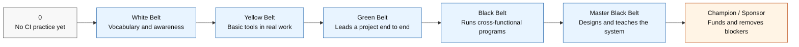

[← Back to Index](./index.md)

---

# Learning, Belts, and Certification

## TL;DR

Lean / Six Sigma certifications use a martial-arts belt metaphor (White → Yellow → Green → Black → Master Black) to signal depth of CI capability — from "knows the vocabulary" to "leads org-wide CI strategy." For CSAs the belt ladder is useful in three ways: (1) as a personal skilling roadmap that turns ad-hoc CI usage into a deliberate progression; (2) as a credential customers recognize, especially in regulated industries and manufacturing-adjacent verticals; (3) as a coaching framework for customer teams — knowing whether you're talking to a Yellow or a Black changes the conversation. Don't chase belts for their own sake; treat each belt as the formalization of capability you should already be demonstrating in real engagements.

## Table of Contents

- [Why belts and certification](#why-belts-and-certification)
- [What the belt levels are](#what-the-belt-levels-are)
- [How to use the belt model](#how-to-use-the-belt-model)
- [When to invest in a belt](#when-to-invest-in-a-belt)
- [Where the belts show up](#where-the-belts-show-up)
- [Who should pursue which belt](#who-should-pursue-which-belt)
- [Examples](#examples)
- [Knowledge check](./knowledge-checks/belts.html)

## Why belts and certification

A CSA can absorb Pareto, Ishikawa, 5 Whys, and 6Ms ad hoc, picking each up the first time an engagement needed it. That works for the basics; it stops working at the level of facilitating a multi-team Kaizen, designing a measurement system, or coaching a customer's own CI program. The belt ladder gives the CSA — and their manager, and their customer — a shared way to talk about *how deep* the CI capability runs, with measurable milestones along the way.

Concretely, the belt model supports:

- Personal skilling plans that progress in a known order rather than randomly.
- Credentialing in customer industries where Lean / Six Sigma is the local dialect (manufacturing, healthcare, financial services, defense, public sector).
- Coaching conversations — meeting a customer Black Belt as a CSA with no formal training puts the CSA at a disadvantage in framing.
- Differentiation in the CSA practice — Green / Black Belt CSAs are credible facilitators for enterprise CI programs, not just users of CI tools.
- Career progression — belts are durable credentials that travel between employers.

**Real example:** A CSA was invited to lead a CI workstream for a Fortune 100 manufacturer's Azure migration. The customer's program office required all workstream leads to hold at least a Green Belt — Lean Six Sigma was the company's operating system. The CSA had been *doing* Green Belt-level work for years but lacked the credential; that engagement triggered the formal training. The belt was less about new skills and more about being allowed to sit at the table.

## What the belt levels are

The belt metaphor originates in Six Sigma but is widely used across Lean, TPS, and CI generally. There is no single global standards body — ASQ, IASSC, and many universities and consultancies all certify — so specifics vary. The level *concepts* are consistent:

- **White Belt (~8 hours).** Awareness. Vocabulary. Understands what CI is, recognizes the canonical tools (Pareto, Ishikawa, 5 Whys, Kaizen, value stream), but does not run them. Useful baseline for any engineer or stakeholder.
- **Yellow Belt (~20–40 hours).** Practitioner of basic tools. Can participate meaningfully in a Kaizen event, run a 5 Whys on a confirmed problem, and contribute to an Ishikawa. Often the target for individual contributors on customer engineering teams.
- **Green Belt (~80–120 hours + a real project).** Leads small-to-medium improvement projects end-to-end. Comfortable with DMAIC (Define-Measure-Analyze-Improve-Control), basic statistics, process mapping, value stream mapping, and PDCA at scale. Certification typically requires demonstrating a project with measured outcomes — often the most valuable part of the program.
- **Black Belt (~160–200 hours + multiple projects).** Leads cross-functional improvement programs. Deep statistics (hypothesis testing, regression, DOE), advanced lean (TPS, theory of constraints), change management, mentoring of Green Belts. The credential that gets you into program-office conversations at large enterprises.
- **Master Black Belt.** Trains and certifies Black Belts; designs an organization's CI strategy. Rare; usually held by the head of a CI / operational-excellence function.
- **Champion / Sponsor (optional executive track).** Not a technical belt — leadership accreditation for sponsoring CI programs, allocating capacity, removing blockers.

Distinctions worth knowing:

- **Lean** belts emphasize waste reduction and flow (Kanban, value stream, Kaizen). **Six Sigma** belts emphasize variation reduction (statistics, DMAIC, control charts). **Lean Six Sigma** is the merged curriculum most enterprises use today.
- **DMAIC** (improve existing process) vs. **DMADV / DFSS** (design new process). Black Belt programs cover both.
- **Accredited (ASQ, IASSC) vs. consultancy-issued.** Accredited carries more weight in regulated industries; consultancy belts are often perfectly fine in tech.

**Real example:** A CSA preparing for a healthcare engagement Googled "Six Sigma certification" and was overwhelmed by ~40 providers ranging from $99 e-learning to $15K immersive programs. They surveyed the customer's program office, learned that ASQ was the recognized credential there, and chose an ASQ-aligned program. Five hours of intake saved months of pursuing a credential the customer wouldn't have accepted.

## How to use the belt model

1. **Audit current capability honestly.** Walk the tool list (Pareto, Ishikawa, 5 Whys, 6Ms, value stream, Kaizen, Kanban, DMAIC, control charts) and mark each as: never used, used once, used repeatedly with confidence, taught to others. The shape determines the right starting belt.
2. **Pick the belt that formalizes the next gap.** Not the highest belt available — the one that codifies what you should *next* be demonstrating. A CSA who has never run a real Kaizen should pursue Yellow, not Black.
3. **Choose accreditation appropriate to the customer base.** ASQ / IASSC for regulated industries; consultancy / university programs are fine elsewhere; vendor-specific (e.g., Toyota Production System programs) for manufacturing-heavy practices.
4. **Treat the project requirement as the point.** Green / Black Belt certifications require a real, measured improvement project. That project is the credential; the test is the formality. Pick a project from real customer work, not a contrived case.
5. **Pair belts with delivery, not training, time.** A Green Belt who hasn't led a project in a year is regressing. Maintain capability via the cadence in [intro.md](intro.md).
6. **Be transparent about the belt with customers.** "I hold a Green Belt; for this scope I'm pulling in a Master Black Belt colleague for the design phase" is a more credible offer than overreaching.
7. **Build a customer-side belt map.** Knowing which roles on the customer side hold which belts shapes the conversation. A customer Master Black Belt expects DMAIC framing; a customer with zero Belts needs to be taught the tools as you go.

**Anti-pattern to avoid:** belt-collecting. A CSA with 5 belts and no validated engagement outcomes is less effective than one with a Green Belt and a track record of measured customer wins.

## When to invest in a belt

Invest when:

- A specific customer engagement requires the credential to participate.
- The next CI capability you need is genuinely codified in the next belt's curriculum (statistics, change management, etc.) — not just lore.
- You are moving into a CSA segment or vertical (manufacturing, healthcare, federal, automotive) where the credential is table stakes.
- You want to coach or certify others — Black Belt is a teaching credential as much as a doing one.

Do **not** invest when:

- You are already running the work at that level and just don't have the certificate. The certificate matters less than the work; chase it only when the certificate is the blocker.
- You haven't run a single CI project end-to-end. Belt programs teach tools, not engagement discipline — get the reps first.
- The customer base doesn't recognize the credential. Time spent on an unrecognized belt is time not spent on the validated playbook library.

**Real example:** A CSA's manager pushed the team to all pursue Black Belt. After 6 months, 3 of 4 CSAs had passed the exam but none had completed the required project. The credential was incomplete in every case and the engagement calendars were unchanged. The pattern reversed the next cycle: each CSA scoped a real customer project as their Belt project, completed it with measured outcomes, and earned the Belt as the *output* of delivered customer value.

## Where the belts show up

Common surfaces:

- **CSA bios and LinkedIn** — Green / Black Belt is a credibility marker in many verticals.
- **RFP / SoW responses** — customer procurement may require named belts on the engagement team.
- **Customer program offices** — enterprises with a formal CI function often require belt-matched participation.
- **Internal MS skilling tracks** — Microsoft has internal Lean Six Sigma training; the iCSU CI CoP is one path.
- **Industry events and certification bodies** — ASQ, IASSC, Shingo Institute, Toyota Production System Support Center.
- **Customer-facing artifacts** — a Pareto authored by a Green Belt CSA reviewed by a customer Black Belt has different standing than the same chart with no credentialed authorship.
- **CSA performance frameworks** — some CSA orgs include belt progression as part of career ladder rubrics.

**Real example:** A CSA team began listing belt credentials next to author names on internal playbooks. Adoption of CI-tooled playbooks rose noticeably — peers treated belt-authored work as a higher trust signal, which (deserved or not) is the social reality of credentialing.

## Who should pursue which belt

- **All CSAs** — White Belt baseline; covers vocabulary so every engagement uses CI language correctly.
- **CSAs running real CI cycles on accounts** — Yellow Belt as a minimum, Green Belt within 12–18 months.
- **CSAs leading enterprise CI programs / WAF programs / multi-team modernization** — Black Belt.
- **CSA managers and CI CoP leads** — Master Black Belt where the org invests in formal CI strategy.
- **Domain specialists (AKS, Data, AI, Security)** — Green Belt is sufficient; deep technical knowledge usually substitutes for higher belts in their domain.
- **Customer engineering ICs** — Yellow Belt; understand the tools enough to participate in CSA-facilitated cycles.
- **Customer SREs / platform leads** — Green Belt; will run the cycles between CSA visits.
- **Customer engineering leadership** — Champion / Sponsor track; understands enough to fund CI without trying to lead it.

The mismatch to avoid: a customer Black Belt program-office lead working with a CSA who does not know what DMAIC means. The CSA either levels up or hands off.

## Examples

### Example 1 — Personal skilling roadmap (CSA, 18 months)

| Quarter | Milestone                                                           |
| ------- | ------------------------------------------------------------------- |
| Q1      | White Belt completed (8h online). Standardize vocabulary in EBRs.   |
| Q2      | Yellow Belt completed. Lead first Pareto + Ishikawa cycle on Account A. |
| Q3      | Green Belt training completed (no certificate yet — project pending). |
| Q4      | Green Belt project: 90-day Cosmos optimization on Account B. Measured: $14K/mo recovered + 8 RU/op P95 reduction. Certificate awarded. |
| Q5      | Mentor a junior CSA through Yellow Belt; co-facilitate one Kaizen.  |
| Q6      | Black Belt scoping; project candidates identified across 2 accounts. |

The credentials trail the work; the work is the point.

### Example 2 — Belt-aware engagement design

Customer's program office hands the CSA an org chart. The CSA annotates belts:

| Customer role               | Belt              | Implication for engagement |
| --------------------------- | ----------------- | -------------------------- |
| VP Engineering              | Champion          | Sponsor; expects ROI in MBR |
| Director, Platform          | Black Belt        | Will challenge methodology; respect rigor |
| Sr. SRE Lead                | Green Belt        | Will own the cadence between visits |
| Platform engineers (8)      | Yellow Belt × 5, none × 3 | Mixed; co-teach as you go |
| Product engineers (12)      | None              | Teach tools experientially |

Engagement design: lead with DMAIC vocabulary at the leadership readout; switch to plain-language Pareto / Ishikawa with the mixed engineering rooms; offer to upskill the 3 uncertified platform engineers to Yellow over the engagement.

### Example 3 — Choosing a certifying body

CSA evaluating providers for Green Belt:

| Provider          | Hours | Cost      | Recognized in     | Project required |
| ----------------- | ----- | --------- | ----------------- | ---------------- |
| ASQ               | 120   | $$$       | Regulated, global | Yes              |
| IASSC             | 80    | $$        | Tech, global      | No (exam only)   |
| University X      | 100   | $$        | Regional / academic | Yes            |
| Consultancy Y     | 60    | $         | Variable          | Sometimes        |

For a CSA serving healthcare and federal customers, ASQ was the right choice despite the higher cost — the credential was the gating factor for engagement participation, not the training itself.

### Example 4 — Green Belt project from real customer work

A CSA structured a customer's AKS reliability program as their Green Belt project:

- **Define:** Sev B incident rate on `checkout` namespace > 8/mo, SLO breach risk.
- **Measure:** baseline 312 Sev B/mo across cluster; checkout = 11.
- **Analyze:** Pareto + Ishikawa + 5 Whys (see [pareto-chart.md](pareto-chart.md), [ishikawa.md](ishikawa.md), [5-whys.md](5-whys.md)).
- **Improve:** ACR private endpoint, CoreDNS autoscale, container memory limits.
- **Control:** Azure Policy + Workbook alerting; standard-work runbook.

Outcome: 178 Sev B/mo (-43%) cluster-wide; checkout to 3/mo. The CSA passed Green Belt by submitting the engagement report. The customer received a validated improvement. Same work, two outputs.

### Example 5 — Black Belt scoping conversation

A CSA's manager asked: "Why pursue Black Belt next quarter?"

CSA's answer: "Three reasons. (1) Account M's program office requires it for the modernization workstream lead. (2) I want to formalize the change-management and DOE knowledge I've been improvising. (3) I'm coaching two Green Belts and Black Belt is the credential to certify them. The Black Belt project is the AKS Automatic + observability platform consolidation on Account M — already scoped, already funded."

The investment is grounded in three specific value sources, not generic career advancement.

### Example 6 — Customer team upskilling track

A CSA designed a 6-month CI upskilling track for a customer's platform team:

| Month | Audience           | Content                                | Belt outcome |
| ----- | ------------------ | -------------------------------------- | ------------ |
| 1     | All engineering    | CI overview workshop                   | White        |
| 2     | Platform team (12) | Tools deep-dive: Pareto, Ishikawa, 5W  | Yellow       |
| 3–4   | SRE leads (3)      | DMAIC, value stream, Kaizen facilitation | Green (in progress) |
| 5     | SRE leads          | Green Belt project execution           | Green project |
| 6     | SRE leads          | Project readout + certification        | Green awarded |

By the end, the customer ran their CI cadence without the CSA. That is graduation, per [intro.md](intro.md).

### Example 7 — Belt mismatch — corrective

A CSA mistakenly framed an EBR with a customer Black Belt audience using elementary CI vocabulary. The Black Belt politely but visibly disengaged.

**Correction:** the next session opened with a Cp/Cpk capability analysis on the customer's deployment process, framed in their language. Re-engaged. The lesson: belt-awareness is a prep activity, not an in-the-moment realization.

### Example 8 — Belt mismatch — coaching down

The reverse case: a CSA with deep CI vocabulary working with a Yellow-Belt customer team. Initial sessions overwhelmed the audience with DMAIC, control charts, and FMEA acronyms. Attendance dropped.

**Correction:** strip back to Pareto + 5 Whys + a one-sentence definition of CI. Reintroduce concepts only as the team's confidence grows. The CSA's belt is not the customer's belt; pace to theirs.

### Example 9 — Master Black Belt — designing a program

A senior CSA with Master Black Belt was asked to design a 2-year CI program for a $50M Unified Support customer. Deliverables included: CI charter, governance model, belt distribution targets, project portfolio framework, measurement system, monthly cadence design, and an exit criterion for the CSA's central role.

The Master Black Belt credential is what made the customer fund the design phase; the design itself is the value. Without the credential, the program would have been led by an outside consultancy at 3x the cost.

### Example 10 — Belt without rigor — failure mode

A CSA earned Black Belt certification from a low-rigor online provider in 4 weeks with no project requirement. Listed it on LinkedIn. Was assigned a CI program lead role based on the credential. The first 30 days exposed the gap — no real DMAIC experience, no statistical fluency, no facilitation reps. The engagement was reassigned; the CSA returned to Green-Belt-level work for 12 months, then re-pursued Black Belt with an accredited program and a real project.

The belt without the underlying work is a liability, not a credential. The CI@MS culture (see [ms-ci-cop.md](ms-ci-cop.md)) treats demonstrated, measured outcomes as the senior signal — the belt is corroborating evidence, not a substitute.
