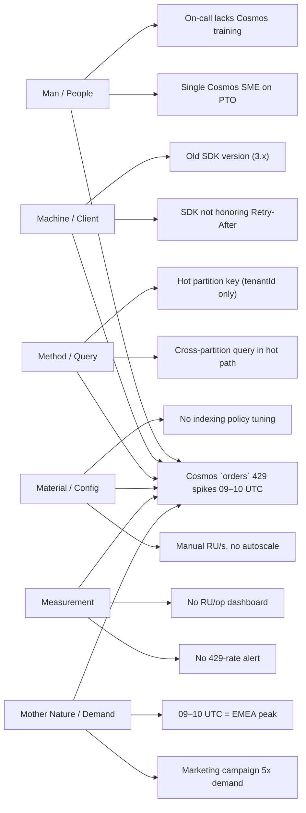

[← Back to Index](./index.md)

---

# Ishikawa Diagram

## TL;DR

An Ishikawa (a.k.a. fishbone or cause-and-effect) diagram is a structured brainstorming tool that maps potential causes of a single problem into named categories — typically the 6Ms (Man, Machine, Method, Material, Measurement, Mother Nature / Environment). For CSAs it is the right tool when a symptom has many plausible causes and the team is at risk of fixating on the first one. Used during postmortems, reliability reviews, WAF assessments, and customer escalations, it forces breadth before depth, surfaces causes outside the speaker's domain (e.g., process and skilling issues that engineers miss because they look only at code), and feeds 5 Whys on the most likely branches. Don't use it for problems with one obvious cause, or to "decide" — Ishikawa generates hypotheses; data confirms them.

## Table of Contents

- [Why Ishikawa diagrams](#why-ishikawa-diagrams)
- [What an Ishikawa diagram is](#what-an-ishikawa-diagram-is)
- [How to use Ishikawa diagrams](#how-to-use-ishikawa-diagrams)
- [When to use Ishikawa diagrams](#when-to-use-ishikawa-diagrams)
- [Where to use Ishikawa diagrams](#where-to-use-ishikawa-diagrams)
- [Who should use Ishikawa diagrams](#who-should-use-ishikawa-diagrams)
- [Examples](#examples)
- [Knowledge check](https://chadhage.github.io/ci-for-icsu/ishikawa.html)

## Why Ishikawa diagrams

When a customer says "our Azure SQL is slow," the on-call engineer's first instinct is to look at queries. The DBA's first instinct is indexes. The network engineer's is VNet integration. The platform lead's is rightsizing. Each is partially right and entirely siloed. Without a structured tool, the postmortem becomes the loudest voice's pet theory, and the next slow-SQL incident reoccurs because the actual cause was in someone else's silo.

The Ishikawa forces the team to walk *every* category before drilling down. It is a deliberate de-fixation tool — it broadens the search space before narrowing it.

Concretely, it supports:

- Postmortems where the root cause spans multiple domains.
- WAF assessments where reliability findings have process + technical contributors.
- Cost overruns where the cause might be code, sizing, demand, billing model, or org incentives.
- Customer escalations where the symptom is one thing and the cause turns out to be another.
- Coaching customer teams who default to "fix the code" thinking.

**Real example:** A CSA's customer reported "Cosmos DB is throttling us." The engineering team had been tuning queries for 3 weeks. A 45-minute Ishikawa session with engineering, platform, product, and SRE surfaced causes across all 6 categories: hot partition key (Method), client SDK without retry-after honoring (Machine), no autoscale (Material), no alerting on 429 trend (Measurement), a marketing campaign that 5x'd demand the prior week (Mother Nature), and a single Cosmos SME on PTO so the on-call team didn't know the configuration (Man). The actual fix was partition key redesign + autoscale; the rest were systemic gaps the team would have hit again. Engineers alone would never have seen most of those.

## What an Ishikawa diagram is

A simple visual structure:

- A horizontal arrow ("spine") pointing at the **problem statement** on the right.
- "Bones" branching off the spine — one per **category** of potential cause.
- Sub-bones on each category for specific causes.
- Sub-sub-bones for contributing factors to each cause (often where 5 Whys takes over).

Standard category sets:

- **6Ms (manufacturing origin, widely used in tech)** — Man, Machine, Method, Material, Measurement, Mother Nature. See [6-ms.md](6-ms.md).
- **6Ps (service / process)** — People, Process, Policy, Place, Procedure, Product.
- **CSA-adapted set** — People & Skills, Code & Config, Architecture & Service, Data & Workload, Observability, Environment & Demand. Equivalent to the 6Ms with cloud terminology.

The categories are scaffolding, not dogma. The goal is to *cover the search space* — any consistent set of 5–7 buckets works.

Key property: an Ishikawa is **divergent** (generates candidate causes); it is not by itself **convergent** (does not pick the cause). After the diagram is filled, the team must use evidence — logs, traces, metrics, telemetry — to confirm which branches matter. Ishikawa output is a hypothesis list, not a conclusion.

**Real example:** A CSA filled an Ishikawa with 31 candidate causes for a checkout latency issue. Telemetry confirmed 2 of the 31 mattered. The other 29 were eliminated cheaply because the diagram made them explicit and testable. Without the diagram, the team would have tested ~5, missed the real ones, and recurred.

## How to use Ishikawa diagrams

1. **State the problem precisely.** "Slow" is not a problem statement. "Checkout API P95 latency exceeds 800ms during 09:00–11:00 UTC weekdays" is. Specificity protects against scope creep mid-session.
2. **Choose category set.** 6Ms is the default; adapt vocabulary to the audience. Confirm with the team before starting.
3. **Assemble cross-functional participants.** Engineering, platform, SRE, product, support, and where possible the customer's business owner. Single-discipline sessions produce single-discipline diagrams.
4. **Brainstorm causes per category.** Round-robin or silent generation; defer judgment. Aim for 4–8 candidates per category before moving on.
5. **Drill 1–2 levels.** For each candidate, ask "what would cause that?" once or twice. Deep drills go to 5 Whys later.
6. **Cluster and prioritize.** Identify the 3–5 candidates most consistent with the symptom and most testable.
7. **Define the test for each.** "If hot partition key is the cause, we should see X in the Cosmos diagnostic logs." Without a test, the candidate is unfalsifiable noise.
8. **Run the tests; confirm causes; convert to actions.** Move into PDCA on the confirmed causes.
9. **Archive the diagram.** Even rejected branches are useful — they document the search space for future similar incidents.

**Anti-pattern to avoid:** treating the diagram as the deliverable. The diagram is a working artifact. The deliverables are the tested hypotheses and the resulting changes.

## When to use Ishikawa diagrams

Use one when **all** of these are true:

- A single, well-defined problem exists (you can write it on the right side of the spine).
- Multiple plausible causes exist across multiple domains.
- The team is at risk of premature commitment to one cause.
- Cross-disciplinary participants are available.

Use in CSA workflows for:

- Postmortems on Sev A/B incidents with non-obvious cause.
- Recurring issues that have survived multiple "fixes."
- WAF reliability and operational excellence reviews.
- Cost overrun investigations where rightsizing alone doesn't explain the spike.
- Customer escalations into PG, to structure the "what we tried" evidence.
- AI / agent failure analysis (hallucinations, drift, evaluation regressions) where causes span data, model, prompt, infra.

Do **not** use one for:

- Problems with one obvious cause confirmed by data — go straight to the fix.
- Decisions about which improvement to invest in — that's a Pareto + value conversation.
- Open-ended exploration with no concrete problem statement — that's a discovery workshop.

**Real example:** A CSA reached for an Ishikawa on "the customer is unhappy." That's not a problem statement. After restructuring the conversation into three crisp problems (P95 SLA missed twice; spend up 22% MoM; release cadence dropped from weekly to monthly), each got its own Ishikawa and its own remediation. The diffuse "unhappy" disappeared once the specifics were addressed.

## Where to use Ishikawa diagrams

Common CSA artifacts and surfaces:

- **Postmortem documents** — embedded diagram + tested hypotheses + actions.
- **WAF assessment workbooks** — per high-impact finding, an Ishikawa drives the remediation reasoning.
- **Reliability / SRE reviews** — recurring incident categories each get a diagram.
- **Cost optimization investigations** — for non-obvious spend spikes (especially data + egress).
- **Modernization assessments** — diagramming "why the current state struggles" to motivate the target state.
- **AI agent quality reviews** — hallucination / refusal / regression Ishikawas spanning prompt, model, tools, data.
- **Coaching sessions** — using the diagram to teach customer engineers to broaden cause hypotheses.

**Real example:** A CSA's customer kept opening Sev B incidents with the same symptom (intermittent App Service 502s). Three prior "fixes" had not held. An Ishikawa session surfaced an unstated assumption — that the cause was the application — and revealed the real cause: an upstream Front Door rule that intermittently bypassed the warm slot during deployments. None of the prior fixes had touched it because nobody framed it as a possibility.

## Who should use Ishikawa diagrams

- **CSAs** — facilitate the session; protect the categories; keep the diagram converging.
- **Customer engineering / SRE leads** — bring the technical hypotheses.
- **Customer product owners / business stakeholders** — bring demand-side hypotheses (campaigns, customer behavior) that engineers miss.
- **Customer support / on-call** — bring symptom-side hypotheses (what the customer actually experiences).
- **Domain CSAs** — bring the deep technical branches (e.g., Cosmos, AKS, AOAI).
- **CSA managers** — apply the lens to engagement-level problems (NSAT misses, scope creep).

Ishikawa fails when only one role is in the room. The whole point is multi-domain coverage.

## Examples

### Example 1 — Cosmos DB throttling

Problem: "`orders` container hits 429 spikes between 09:00–10:00 UTC."

Tested hypotheses (top 3): hot partition key, no autoscale, marketing campaign. All confirmed. Fix: HPK redesign + autoscale + capacity comms with marketing.

### Example 2 — AKS rolling deployment failures

Problem: "20% of rolling deployments fail with `ImagePullBackOff`."

| Category    | Candidate causes                                                |
| ----------- | --------------------------------------------------------------- |
| Man         | New engineers don't know ACR auth model; no runbook             |
| Machine     | Kubelet not using managed identity; ACR throttling at peaks     |
| Method      | Image tags mutable; deployments race image push                 |
| Material    | ACR on public endpoint; no private endpoint; SKU = Basic        |
| Measurement | No alert on pull failures; no ACR throttle dashboard            |
| Mother      | Deploys cluster on Friday 16:00 — same time as image build job  |

Tested + confirmed: kubelet identity + ACR private endpoint. Deferred but valid: image tag immutability (separate Method fix).

### Example 3 — Front Door 502 intermittent

Problem: "Front Door returns 502 to ~3% of users during deploys."

Branches (abbreviated): origin warm-up missing (Method); deployment slot swap timing (Method); origin health probe too strict (Material); rule-set bypass during cutover (Material); insufficient origins (Material); telemetry sampling hiding the spike (Measurement); release window during peak (Mother). The Material branch held the real cause — a rule-set exception clause that misrouted ~3% of traffic during slot swap.

### Example 4 — Service Bus DLQ surge

Problem: "DLQ messages spiked 8x in 48h on `orders-processor`."

| Category    | Candidate                                              |
| ----------- | ------------------------------------------------------ |
| Man         | New consumer code by junior dev, no PR review by SME   |
| Machine     | Consumer pod OOMKilled mid-batch                       |
| Method      | No idempotency in handler                              |
| Material    | MaxDeliveryCount = 3, too low for the workload         |
| Measurement | No DLQ depth alert                                     |
| Mother      | Upstream system pushed 4x normal volume                |

Confirmed: OOMKilled + low MaxDeliveryCount + upstream burst. Fix: container memory limits, MDC raised to 10 with backoff, autoscale on the consumer.

### Example 5 — Azure OpenAI throttling on RAG pipeline

Problem: "RAG pipeline gets 429 from AOAI in production at 14:00 UTC."

Branches surface: single-region deployment (Material), no PTU (Material), embedding regen runs at 14:00 (Method), no semantic cache (Method), new product feature shipped 2 days ago (Mother), no token-rate dashboard (Measurement), customer doesn't know PTU exists (Man).

Fix: schedule embedding regen off-peak + introduce semantic cache + plan PTU sizing.

### Example 6 — Cost spike (non-obvious)

Problem: "Azure spend up 22% MoM with no traffic increase."

| Category    | Candidate                                                  |
| ----------- | ---------------------------------------------------------- |
| Man         | New engineer left dev VMs running over a holiday           |
| Machine     | App Insights ingestion volume up 4x                        |
| Method      | A debug log statement at INFO escaped to prod              |
| Material    | Storage retention policy changed; cool→hot via mis-policy  |
| Measurement | No budget alert at 80% threshold                           |
| Mother      | A new region was added by another team for DR              |

Confirmed: debug log + storage policy. The new region was a real driver too, but funded — not waste.

### Example 7 — Agent hallucination regression

Problem: "Foundry agent hallucination rate doubled after Tuesday's deploy."

Branches: prompt change in PR #482 (Method); model version auto-upgraded (Machine); evaluation dataset stale (Measurement); knowledge index refresh missed (Material); on-call rotated, no agent SME (Man); user query distribution shifted (Mother).

Confirmed: prompt change + model auto-upgrade. Action: pin model version; gate prompt changes on eval suite re-run.

### Example 8 — SLA miss in two consecutive months

Problem: "P95 latency SLA missed in Sep and Oct."

Categories drove the team to look beyond code: deploys overlap with EU peak (Mother); a noisy neighbor on shared SQL elastic pool (Material); no warming script after maintenance windows (Method); no per-region P95 dashboard (Measurement). Fix: re-time deploys + isolate the noisy tenant + warming script + per-region SLO dashboard.

### Example 9 — Recurring "fix didn't hold"

Problem: "We fixed CoreDNS resolution timeouts in July; same symptom is back in October."

Ishikawa explicitly includes a *Measurement* and *Method* re-check: regression not caught because no automated probe was added (Measurement); fix was applied as manual edit, not IaC (Method); on-call rotated, knowledge not transferred (Man). The technical fix held; the *process* around it did not. Action: convert fix into IaC; add synthetic DNS probe; document in runbook.

### Example 10 — Engagement-level Ishikawa (CSA practice)

Problem: "CSA team NSAT for new strategic accounts is below target."

| Category    | Candidate                                                            |
| ----------- | -------------------------------------------------------------------- |
| Man         | New CSAs onboard via shadowing only; inconsistent depth              |
| Machine     | Tools fragmented across 5 surfaces; long time to first dashboard     |
| Method      | No standard 30-day intake; each CSA improvises                       |
| Material    | Playbook library outdated for AI / Foundry engagements               |
| Measurement | NSAT measured at 6mo; too late to course-correct                     |
| Mother      | Customer expectations have shifted post-AI launches; CSA framing lags |

Action: standardize 30-day intake (Method); refresh AI playbooks (Material); add 30-day pulse survey (Measurement); update onboarding (Man). The Ishikawa works inside Microsoft too.
